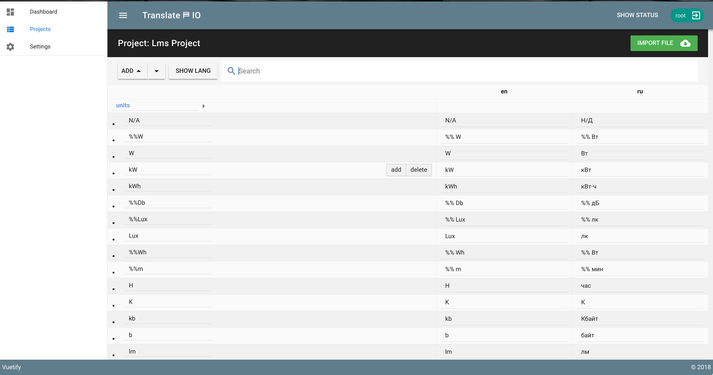

# ⛿ Translate.io


### Store and share translates  for your projects


+


## Use it!
#### Docker
and docker-compose.
```
# run mongodb
$ docker-compose up -d mongodb
# and app
$ docker-compose up -d app
```

#### Manual
u need run localhost and set environments in .env
```
# and run app
$ ./script/start

```

Default auth  root/root


### Coming Soon
- add and manage users/roles
- resolve performance for big projects
- realtime update


**how is it look**


